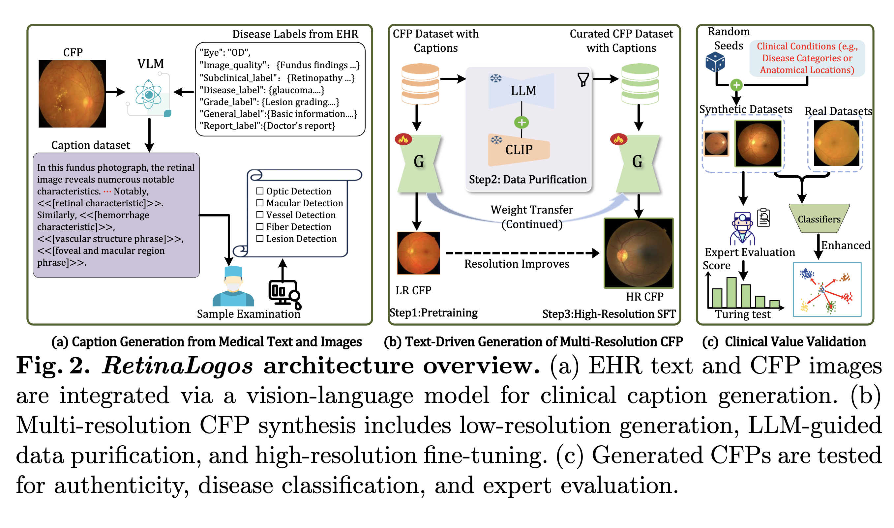
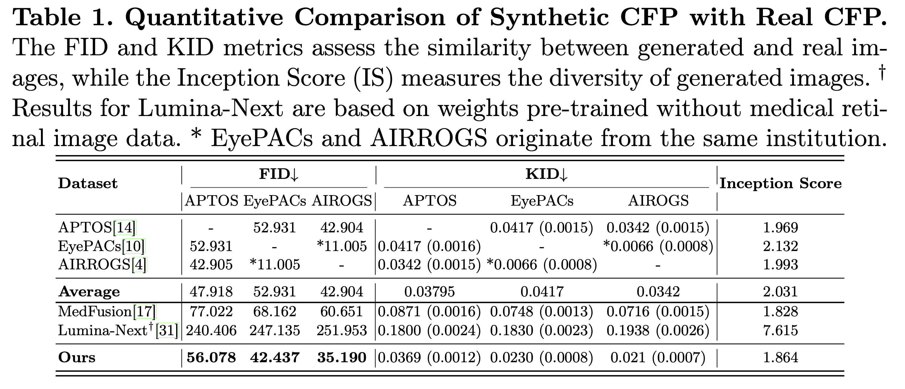
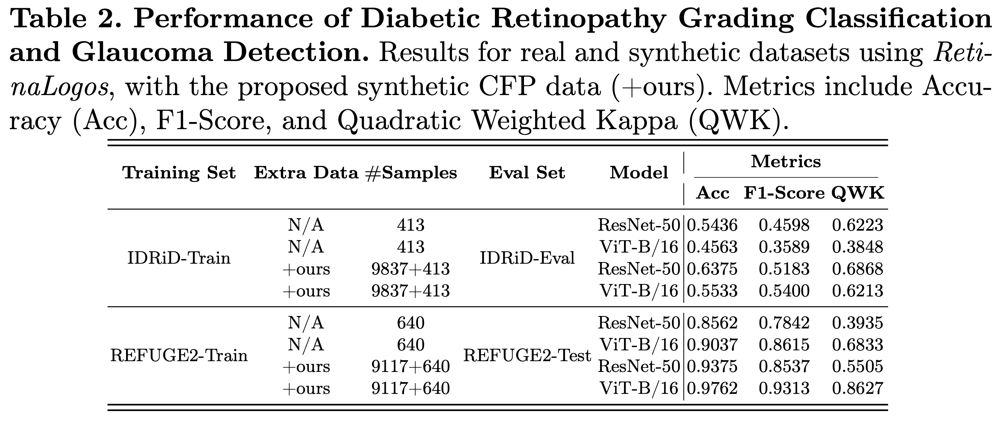
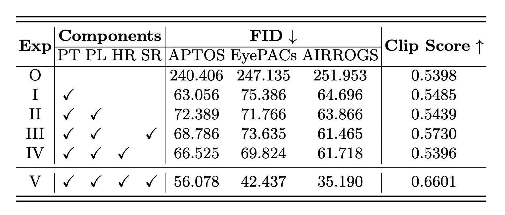
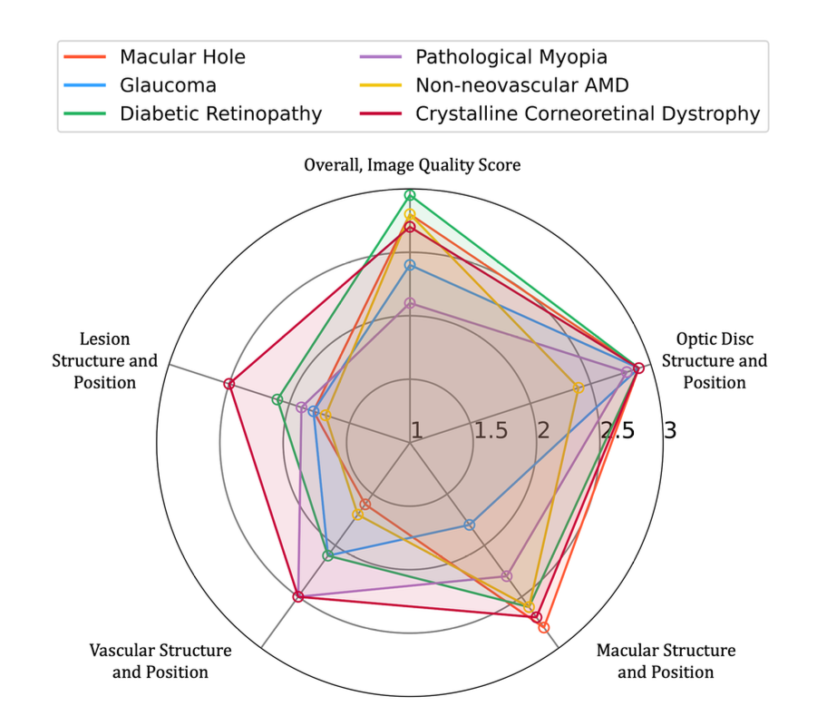

# RetinaLogos: Fine-Grained Synthesis of High-Resolution Retinal Images Through Captions

This Repo presents the implementation of **RetinaLogos: Fine-Grained Synthesis of High-Resolution Retinal Images Through Captions**, a novel method designed to generate high-resolution Color Fundus Photographs (CFPs) from textual descriptions of retinal conditions. Our method addresses the limitations of existing retinal image synthesis models by providing more detailed and fine-grained control over anatomical structures and disease progression using large-scale text-to-image generation techniques.

## 🌟 Abstract

- **Why Ours Is Important?**  
  

The scarcity of high-quality, labeled retinal imaging data presents a significant challenge in ophthalmology. In this work, we introduce **RetinaLogos**, a groundbreaking text-to-image framework that utilizes a large-scale synthetic caption dataset (1.4 million entries) to generate high-resolution retinal images. Our approach combines Electronic Health Records (EHRs) with multimodal text generation, enabling fine-grained semantic control over the generated images. **RetinaLogos** can synthesize retinal images that capture subtle anatomical variations and disease progression, providing valuable insights for early detection and clinical training purposes. Our method demonstrates state-of-the-art performance across multiple datasets, achieving a 10%-25% improvement in classification tasks such as diabetic retinopathy grading and glaucoma detection.

## 🎬 Video Demonstration

Visit our [project page](scr/video720.mov) to watch the demonstration video.

## 💡 Highlights 

- **Large-Scale Synthetic Dataset**: We have developed **RetinaLogos-1400k**, a synthetic dataset containing 1.4 million retinal caption-image pairs. This enables the generation of high-resolution, clinically relevant Color Fundus Photographs (CFPs) across a wide range of retinal conditions.

- **Fine-Grained Control Over Retinal Images**: RetinaLogos allows for precise control over retinal anatomical structures and disease stages using free-form textual prompts, providing unprecedented customization for lesion types, disease progression, and anatomical variations.

- **State-of-the-Art Performance**: RetinaLogos demonstrates superior performance in generating clinically accurate retinal images. 62.07% of text-driven synthetic images are indistinguishable from real ones by ophthalmologists, with significant improvements (10%-25%) in diabetic retinopathy grading and glaucoma detection.

## 🚀 Model Pipelines and Fusion Graphical Illustration:

- **Overview of Method Pipeline**  
  

## Generated CFP Results and Downstream Datasets

- **Quantitative Comparison of Synthetic CFP with Real CFP**  
  

- **Performance of Diabetic Retinopathy Grading Classification and Glaucoma Detection**  
  

- **Ablation_Study of RetinaLogos Model using Our Approach**  
  

- **Evaluation of  Real and Sythnetic CFPs**  
  

- **Evaluation of Individual Rare Diseases**  
  

## 🖼️ Illustrative Examples:
- **Visual Comparison of Generated CFPs under Different Stages, Resolutions, and Pathological Structures**  
  

- **More Examples**  
  
  

## 🚨 Code Release

We hope to make the source code for **RetinaLogos** available upon acceptance of the paper. Please stay tuned for updates, and the code will be shared on our GitHub repository as soon as it is ready.

- **Acknowledgment**: We would like to express our gratitude to the authors of the **Lumina-Next** framework for their contributions, which helped strengthen and accelerate the development of our model. You can access their code here: [Lumina-Next](https://github.com/Alpha-VLLM/Lumina-T2X/tree/main/lumina_next_t2i) and [Lumina 2.0](https://github.com/Alpha-VLLM/Lumina-Image-2.0).
